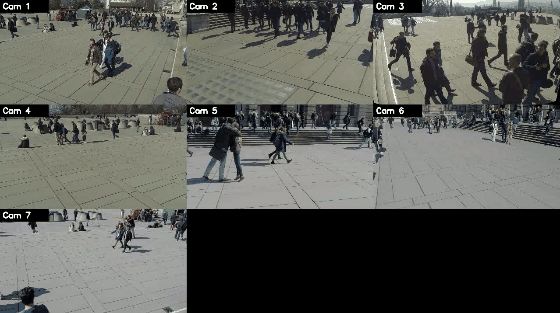
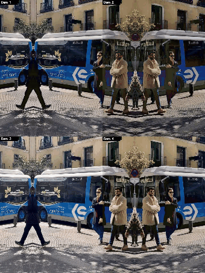

# Multi-Camera Tracking — WILDTRACK Demo

Multi-camera pedestrian detection + tracking that turns a synchronized
multi-view dataset (e.g. [WILDTRACK](https://www.epfl.ch/labs/cvlab/data/data-wildtrack/))
into an annotated **per-camera + grid-montage demo video** with a single command.

[](https://www.python.org/downloads/)
[](https://pytorch.org/)
[](LICENSE)

```
FrameSource (WILDTRACK / video / images)
        │   synchronized Dict[cam_id → Frame]
        ▼
   YOLO detection  →  per-camera ByteTrack-style tracking  →  (optional) OSNet ReID cross-camera association
        │
        ▼
   per-camera mp4  +  N-view grid montage mp4   (cv2.VideoWriter, mp4v)
```

### Demo — WILDTRACK, 7 synchronized cameras



*7 camera views of the same plaza, pedestrians detected and tracked per view.
Full clip: [`demo/wildtrack_grid.mp4`](demo/wildtrack_grid.mp4) (80 frames, ~13 tracks/view).
Reproduce with the WILDTRACK command in **Quick Start**.*

<details>
<summary>Self-test demo (synthetic, no dataset download)</summary>



Generated by `python scripts/make_demo.py --self-test` — proves the full
source → detect → track → video pipeline with zero external data.
</details>

---

## Quick Start

```bash
# 1. Install
pip install -r requirements.txt

# 2. Smoke-test the whole pipeline with NO dataset download
#    (downloads a YOLO weight + a sample image, generates outputs/grid.mp4)
python scripts/make_demo.py --self-test

# 3. Generate the real WILDTRACK demo (after downloading the dataset, see below)
python scripts/make_demo.py \
    --dataset wildtrack --root data/wildtrack \
    --cameras 1,2,3,4,5,6,7 \
    --max-frames 100 --model yolo26s --conf 0.4
```

Outputs land in `outputs/`:
- `cam<N>.mp4` — one annotated video per camera
- `grid.mp4` — all views tiled into a single montage
- `run_meta.json` — model, device, frame counts, timing

## Getting WILDTRACK

WILDTRACK is **not** included (it contains identifiable pedestrians — only the
generated videos are meant to be shared).

1. Download from the [EPFL CVLAB page](https://www.epfl.ch/labs/cvlab/data/data-wildtrack/)
   (7 synchronized 1080p cameras, 400 annotated frames @ 2 fps).
2. Extract so the layout is:
   ```
   data/wildtrack/Image_subsets/C1/00000000.png ...
   data/wildtrack/Image_subsets/C2/...
   ...                          C7/...
   ```
3. Run the command in step 3 above.

The loader (`from_wildtrack`) auto-discovers `C1..C7`, so any subset of cameras works.

## Input modes (`scripts/make_demo.py`)

| Mode | Flags |
|------|-------|
| Self-test (synthetic) | `--self-test` |
| WILDTRACK / image-sequence dataset | `--dataset wildtrack --root <DIR>` |
| Generic image folders (`<DIR>/C1`, `C2`, …) | `--dataset images --root <DIR>` |
| One video file per camera | `--dataset video --videos a.mp4,b.mp4,...` |

Useful flags: `--cameras 1,2,3` · `--max-frames N` · `--step K` · `--conf 0.4`
· `--reid` (cross-camera IDs via OSNet) · `--device cpu` · `--no-grid` / `--no-per-camera`.

`--device cuda:0` automatically falls back to CPU when no GPU is present.

## How it works

| Stage | File | Notes |
|-------|------|-------|
| Input abstraction | [src/data/sources.py](src/data/sources.py) | `FrameSource` → WILDTRACK / video / image-seq / synthetic |
| Detection | [src/tracking/detector.py](src/tracking/detector.py) | Ultralytics YOLO (`yolo26s`, auto-falls back to `yolo11s`) |
| Tracking | [src/tracking/tracker.py](src/tracking/tracker.py) | Per-camera ByteTrack-style association + constant-velocity smoothing |
| Cross-camera ReID | [src/tracking/reid.py](src/tracking/reid.py) | OSNet (torchreid) embeddings + union-find global IDs |
| Video output | [src/tracking/video_writer.py](src/tracking/video_writer.py) | `mp4v` per-camera + grid montage |
| Orchestration | [scripts/make_demo.py](scripts/make_demo.py) | Single reproducible entry point |

### Honest implementation notes
- The "Kalman filter" in the tracker is a lightweight constant-velocity /
  fixed-gain smoother, **not** a full Kalman filter — sufficient for the demo.
- Cross-camera association is **per-frame** (no temporal smoothing across frames yet).
- Cross-camera IDs require `--reid`; without torchreid installed, ReID falls back to
  random embeddings and prints a loud warning (so it is never silently meaningless).

## Tests

```bash
pytest tests/ -v          # smoke tests: sources, tracker union-find, video writer
```

## Not in scope

This repository is intentionally focused on *dataset → demo video*. The following
were part of an earlier over-scoped plan and are **not** implemented (kept only as
possible future work): live USB-camera capture, MLflow/Prometheus/Grafana/DVC,
FastAPI/WebSocket server, CI/CD, Docker production stack. The `src/mlops/` modules
are frozen and import-optional.

## License

MIT — see [LICENSE](LICENSE).

## Acknowledgments

- [Ultralytics YOLO](https://github.com/ultralytics/ultralytics) — detection
- [ByteTrack](https://github.com/ifzhang/ByteTrack) — tracking algorithm reference
- [torchreid](https://github.com/KaiyangZhou/deep-person-reid) — OSNet ReID
- [WILDTRACK](https://www.epfl.ch/labs/cvlab/data/data-wildtrack/) — multi-camera dataset
